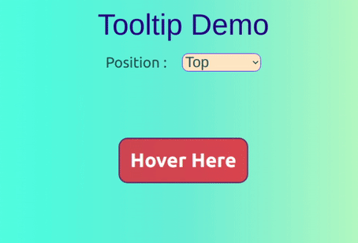

# Tooltip

Tooltip is a message which appears when a cursor is positioned over an icon, image, hyperlink, or other element in a graphical user interface.

# Preview



<!-- ## Visit app at http://google.com -->

### Techstack :- HTML, CSS, JS, React

# Instructions to install

1. Clone this repository from https://github.com/dheerajk7/tooltip-react-test-cn.git
2. Install NPM if you have not installed yet.
3. Go to project directory and run these commands

   #### To install node Modules

   ```
   npm install
   ```

   #### To run project

   ```
   npm start
   ```

4. Go and check at http://localhost:3000

---
